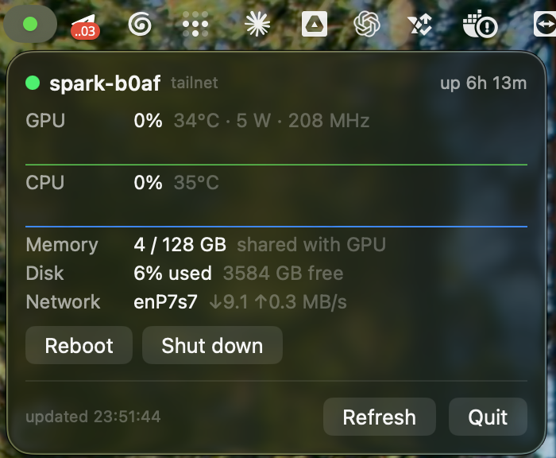
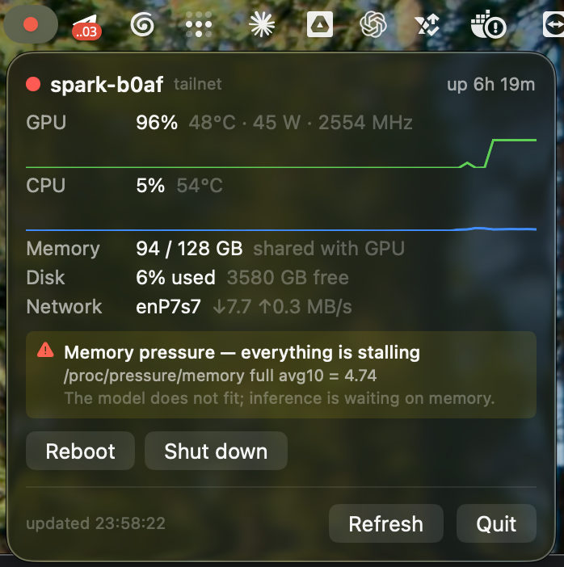

# DGX Spark status LED

The NVIDIA DGX Spark has no status light. No power LED, no activity indicator,
nothing — you cannot tell from across the desk whether the box is on, asleep, or
quietly throttling itself down to a quarter of its speed.

<p>
  
</p>
<p>
  
</p>

That bothered me enough to build one. It lives in the Mac menu bar.



**🟢 up · 🟡 something is off · 🔴 in trouble, or not answering**

Green means the Spark is up and nothing is overheating, throttled or out of
memory — above, it is 96% busy and perfectly happy. Click the dot for the
numbers, or shut the box down before you pack it into a bag.

## Install

Paste this into Claude Code, Cursor, Codex, or whichever agent you keep in a
terminal:

```text
Install dgx-spark-bar: https://github.com/leplik/dgx-spark-bar

My DGX Spark is at <host-or-ip>, ssh user <user>.

Read AGENTS.md in that repo and follow it: install the agent on the Spark
over ssh, then install the menu-bar app on this Mac and launch it. Tell me
what colour the dot is when you're done.
```

Fill in the two placeholders and let it run — about a minute, and the dot
appears. Nothing to configure afterwards: the app finds the box on your tailnet
or over Bonjour by itself.

No agent to hand? [AGENTS.md](AGENTS.md) is the same steps as plain commands,
and [Releases](https://github.com/leplik/dgx-spark-bar/releases/latest) has the
built app.

## What the dot knows

A generic server monitor reads `nvidia-smi` on a Spark and shows *"VRAM: N/A"*,
because GB10 is not a discrete GPU:

* **There is no separate VRAM.** Grace and Blackwell share one pool, so
  `nvidia-smi` reports `FB Memory Usage: N/A` on purpose. Memory comes from
  `/proc/meminfo`, labelled *shared with GPU* rather than pretending to be a
  framebuffer.
* **"It did not fit"** shows up as memory-pressure stalls
  (`/proc/pressure/memory`) and swap — never as a full framebuffer, because
  there isn't one to fill.
* **A throttled Spark** — a busy GPU drawing 14–25 W for three polls in a row —
  turns the dot yellow, and red if the SM clock has collapsed too. It is the most
  common reason a demo runs at a quarter speed while every dashboard still looks
  green.

When something does go wrong, the dot turns and says so in words, not in a
metric you have to interpret:



Thresholds are adapted from [spark-doctor](https://github.com/joeynyc/spark-doctor)
(MIT), whose numbers come from reported DGX Spark field behaviour rather than
from a desk.

## Two parts, no cloud

A Python agent on the Spark — stdlib only, no pip, no virtualenv, running as
your user rather than root — and a SwiftUI menu-bar app on the Mac. No account,
no database, no telemetry, no daemon on the Mac beyond the app itself.

The agent has no background loop either: every number is read when a client
asks, and between requests the process sleeps on `accept()`. Nothing runs on the
Spark while nobody is looking.

It also has **no authentication**, deliberately — a shared secret to copy
between machines was more friction than the threat it removed on a network that
is private by construction. Keep it on a tailnet or a LAN you trust. Actions are
a fixed whitelist of two: reboot and power off.

## Plugins: your buttons, not ours

Anything box-specific — a deploy, a demo reset, a cache warm — stays out of
this repo. Drop an executable into `/etc/dgx-spark-bar/plugins/` and it becomes
a button in every connected menu-bar client:

```bash
#!/usr/bin/env bash
# desc: Deploy the demo stack
# confirm: yes
exec /usr/local/bin/my-deploy
```

The filename is the action name, `# desc:` is the caption, `# confirm: yes`
makes the client ask first. Output lands in
`/var/lib/dgx-spark-bar/plugin-logs/<name>.log`, served back at
`GET /plugin-log?name=X` — the client's **Log** button opens it in a browser,
so a 20-minute build is watchable from the couch. One instance per plugin at a
time; a green/red dot remembers how the last run ended.

Two things to know before writing one. First, there is no auth, so a plugin is
remote code execution for anyone who can reach the port: the plugins dir must
stay writable by root only, and the agent refuses group- or world-writable
files. Second, plugins inherit the unit's sandbox — `ProtectHome=read-only`,
`ProtectSystem=full`, `PrivateTmp` — so keep working state under `/var/lib`
(readable secrets like `~/.ssh` keys still work; writing to `$HOME` does not).

## Links: open what the box serves

A plugin runs *on the box*. Opening a web UI happens on your laptop, so it
cannot be one — a headless Spark has no browser. Declare it instead: drop a
file into `/etc/dgx-spark-bar/links/` and the client shows a button that opens
it, next to a dot saying whether the port is answering.

```ini
NAME=Open Zolli
PORT=3200
URL_PATH=/
DESC=Customer cabinet
```

No host, on purpose. The client fills in the host it is already talking to, so
one file works over the tailnet, over the LAN and over a manually added address
without knowing any of them — and a link can only ever point at the box itself.
These files are data: never executed, and a `URL_PATH` carrying a scheme or a
bare authority is dropped.

The dot is advisory: the agent probes loopback, so a service bound to a LAN
address only reads as down while your browser still reaches it. The button is
never disabled because of it.

The HTTP API, every config key, the discovery channels and the troubleshooting
steps live in [AGENTS.md](AGENTS.md).

## License

MIT.
